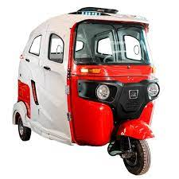
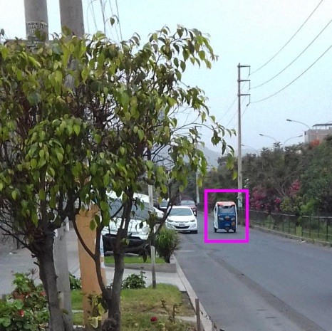
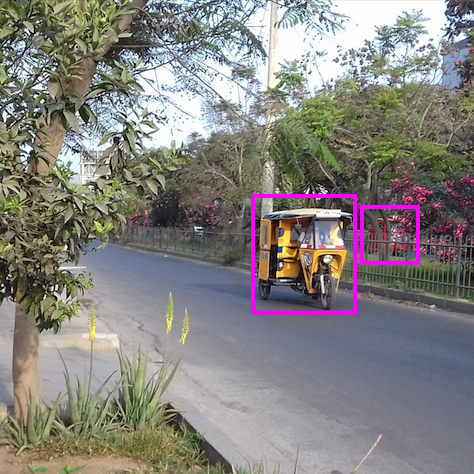
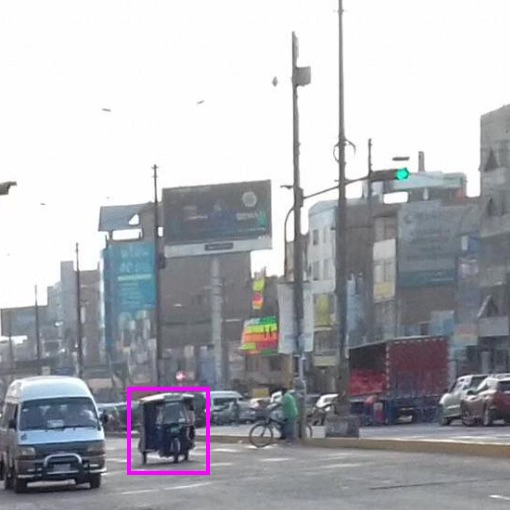

# Convolutional Neural Networks: Recognition of mototaxis

The objective is to show the use of AI for detecting the presence/absence of mototaxis in complex environments. All necessary code is provided; although, the raw training data is not. Interested users are encouraged to build their own datasets.

  
   
  
  

The remarkable success of neural networks is mostly due to two factors that have converged only recently, within the last decade: 1) the availability of large datasets and 2) access to large computational resources. Currently, developing and training new AI architectures from scratch would require a fair share of hardware (GPU) resources; nonetheless, here we show a workflow that can still be run and tested on the CPU of a regular laptop for illustrating the variety of concepts involved.

## Pytorch implementation:
1. Preprocessing the raw images.
    - For convenience all image crops are made larger than 224x224 pixels for MobileNet and square (same height and width) to avoid padding.
    - Some cameras add rotation flags which will rotate the images when visualizing them in Python.
    - Helper utilities for the task of manually cropping camera images. See `notebooks/manual_cropping.py`.
2. [DataLoaders: Pipeline for feeding the data.](http://nbviewer.ipython.org/urls/github.com//luis-agapito/AI_mototaxi/blob/main/notebooks/data_loaders.ipynb)
    - Partitioning the data into three datasets: train, validation (aka, development), and test.
    - Building the Dataloader.
    - Inspecting the Dataloader: Verify the images comprising minibatches for each epoch.
3. Customizing MobileNet [^1].
    - [Evaluating performance of the default model.](http://nbviewer.ipython.org/urls/github.com//luis-agapito/AI_mototaxi/blob/main/notebooks/default_model.ipynb)
    - [Fine-tuning the model. Two cases: single and multiple layers.](http://nbviewer.ipython.org/urls/github.com//luis-agapito/AI_mototaxi/blob/main/notebooks/custom_model_training.ipynb)
4. [Evaluating the performance of the fine-tuned model.](http://nbviewer.ipython.org/urls/github.com//luis-agapito/AI_mototaxi/blob/main/notebooks/custom_model_verification.ipynb)

## Tensorflow-Keras implementation:

[^1]: [paper](https://arxiv.org/abs/1801.04381), [implementation](https://pytorch.org/hub/pytorch_vision_mobilenet_v2/)